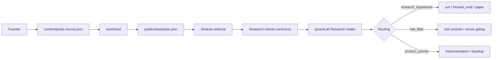

# Quant Pulse — Formato canónico de signal intents para QuantLab Research

## Propósito

Este documento define el formato canónico de los `research intents` que cruzan la frontera entre Quant Pulse y QuantLab Research.

Quant Pulse sigue produciendo su feed editorial humano en `public/data/pulse.json`, pero solo los items que cruzan el umbral de señal se convierten en intents para QuantLab.

En Fase 1, esos intents se publican como artefacto estático adicional en:

- `public/data/intents.json`

## Flujo exacto

Reglas del flujo:

1. `content/pulse.source.json` es la fuente editorial operativa de Fase 1.
2. `public/data/pulse.json` es el feed publicado para lectura humana.
3. La síntesis editorial convierte una historia o una combinación de historias en un intent solo si aporta valor downstream.
4. Los items que no cruzan el umbral de señal se quedan como contexto en el feed editorial.
5. QuantLab Research no consume la narrativa cruda como entrada de trading; consume el intent estructurado.

## Regla de frontera

QuantPulse emite contexto, prioridad y estructura.
QuantLab Research decide si ese intent merece:

- hipótesis de research
- filtro de riesgo
- prioridad de producto

Si no merece una de esas tres salidas, no cruza la frontera.

## Schemas canónicos

El contrato machine-readable vive en:

- `config/research-intent.schema.json`
- `config/research-intents-document.schema.json`

Responsabilidad de cada schema:

- `config/research-intent.schema.json`: valida cada intent individual de handoff.
- `config/research-intents-document.schema.json`: valida el documento contenedor publicado en `public/data/intents.json`.

El artefacto publicado mantiene así dos niveles de contrato:

- wrapper estable del documento
- payload estable por intent

## Documento publicado

El documento publicado en `public/data/intents.json` debe incluir:

- `generatedAt`
- `editionId`
- `sourceVersion`
- `sourceUpdatedAt`
- `intentCount`
- `intents`

Reglas mínimas del documento:

- `intentCount` debe coincidir con `intents.length`
- `intents` debe existir incluso cuando no haya intents elegibles
- el documento debe seguir siendo determinista para una misma edición fuente

## Estructura del intent

El payload canónico debe incluir siempre:

- `schema_version`
- `intent_id`
- `edition_id`
- `created_at`
- `signal_summary`
- `priority`
- `affected_universe`
- `bias`
- `horizon`
- `hypothesis_type`
- `validation_goal`
- `invalidation_condition`
- `risk_filter_hint`
- `product_priority_hint`
- `route`

Campos opcionales:

- `source_ref`
- `notes`

## Semántica de los campos

- `schema_version`: versión estable del contrato.
- `intent_id`: identificador único del intent.
- `edition_id`: edición o snapshot de origen.
- `created_at`: marca temporal UTC de generación.
- `source_ref`: trazabilidad opcional a historias, URLs o anchors internos.
- `signal_summary`: resumen corto de la señal.
- `priority`: `P1`, `P2` o `P3`.
- `affected_universe`: activos, venues, sectores, rails o sistemas afectados.
- `bias`: sesgo tentativo a validar.
- `horizon`: ventana temporal relevante.
- `hypothesis_type`: familia cuantitativa o de producto que QuantLab debería considerar.
- `validation_goal`: evidencia que confirmaría el intent.
- `invalidation_condition`: condición observable que lo descartaría.
- `risk_filter_hint`: implicación para filtros, exclusiones o límites.
- `product_priority_hint`: implicación para instrumentación, cobertura o backlog.
- `route`: destino downstream del intent.

## Routing downstream

El campo `route` solo puede tomar estos valores:

- `research_hypothesis`
- `risk_filter`
- `product_priority`

QuantLab Research usa ese valor para enrutar el intent, pero la decisión final sigue siendo de QuantLab Research.

## Regla de seguridad semántica

No mezclar:

- el feed humano
- el intent canónico
- la validación cuantitativa

Cada capa tiene una responsabilidad distinta. Si se cruza esa frontera, el sistema pierde trazabilidad.
